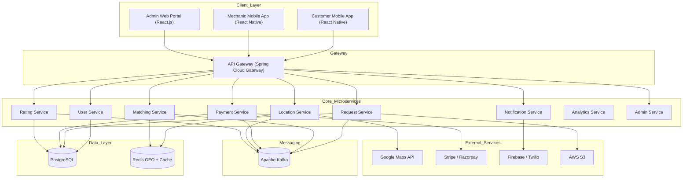
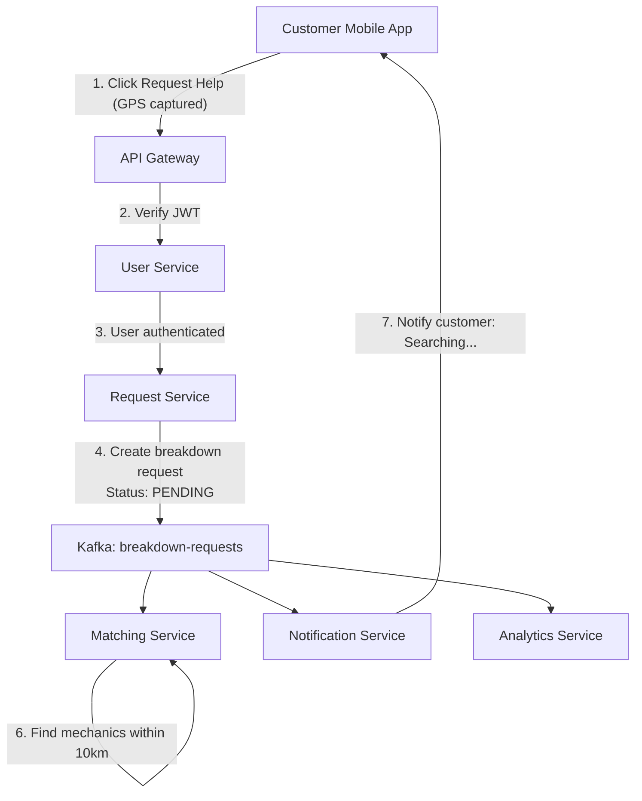
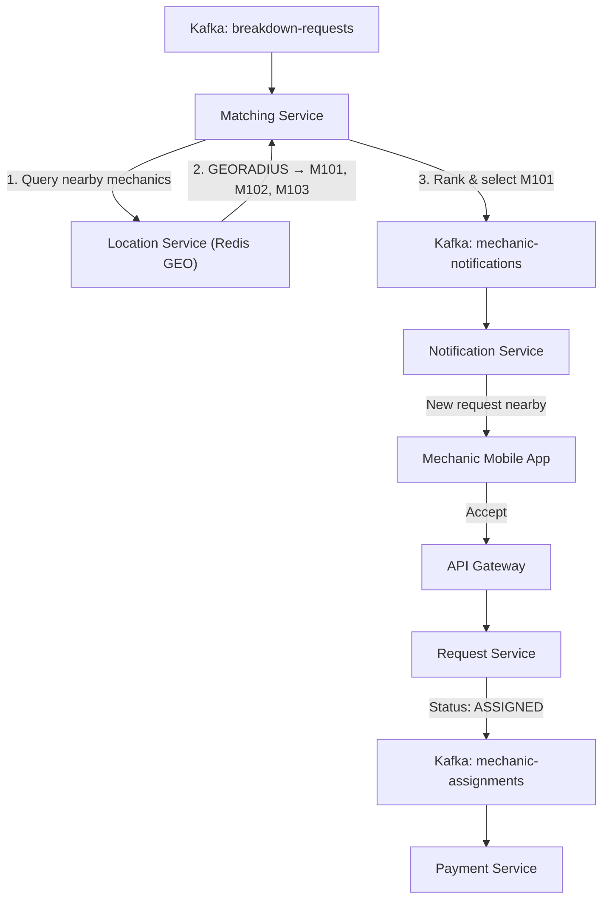
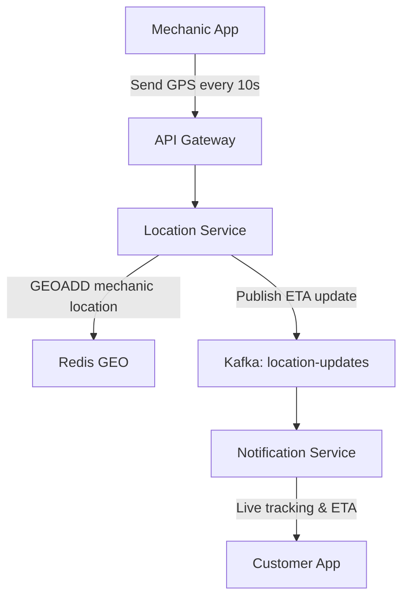
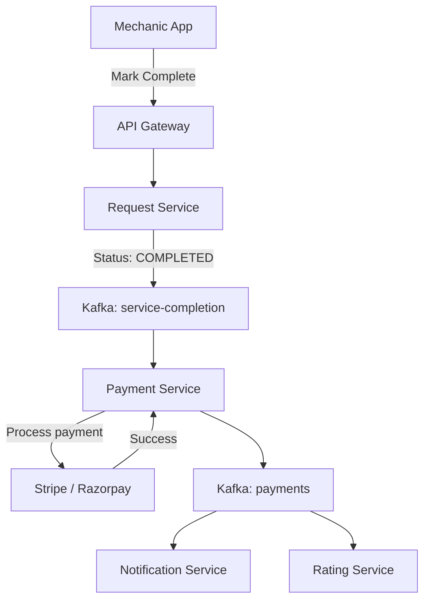
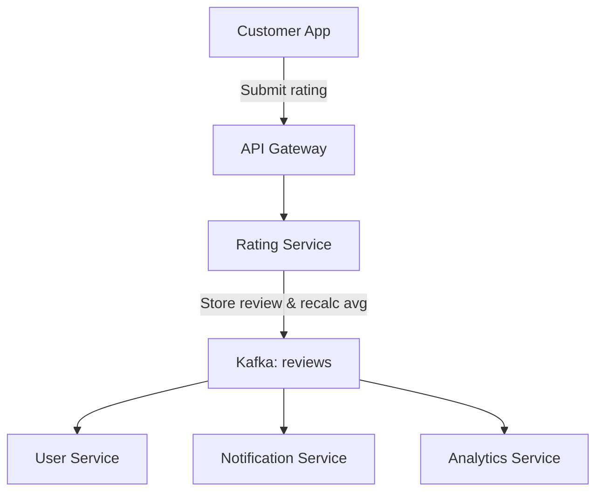

🚗 RoadRescue


> **Help on Wheels, Anytime, Anywhere**

RoadRescue is a **mobile-first roadside assistance platform** that connects stranded vehicle owners with **verified nearby mechanics** in real time. Built using **Spring Boot microservices**, **Kafka**, and **cloud-native architecture**, it ensures fast response, transparent pricing, and secure payments.

---

## 📌 Table of Contents

- [Problem Statement](#-problem-statement)
- [Solution Overview](#-solution-overview)
- [Key Features](#-key-features)
- [System Architecture](#-system-architecture)
- [Microservices Overview](#-microservices-overview)
- [Business Flow](#-business-flow)
- [Edge Cases & Business Rules](#-edge-cases--business-rules)
- [Performance Optimizations](#-performance-optimizations)
- [Tech Stack](#-tech-stack)
- [Future Enhancements](#-future-enhancements)
- [License](#-license)

---

## ❗ Problem Statement

Vehicle breakdowns in unfamiliar or remote locations create serious challenges:

- No access to trusted mechanics
- Safety risks, especially at night or highways
- Unclear pricing and overcharging
- Long wait times with no ETA visibility
- Difficulty sharing exact location

---

## ✅ Solution Overview

RoadRescue solves this by providing:

- 📍 **Real-time mechanic discovery** using GPS
- 🔍 **Smart matching algorithm** based on distance, rating & specialization
- 💬 **Live tracking & notifications**
- 💳 **Transparent pricing & secure payments**
- ⭐ **Ratings & review system for trust**

---

## 🌟 Key Features

- Customer & Mechanic mobile apps
- Real-time location tracking
- Event-driven architecture with Kafka
- Secure JWT authentication
- Online payments with deposit holds
- Automated rating & badge system
- Admin dashboard for dispute handling

---

## 🏗 System Architecture

### High-Level Overview

---

## 🧩 Microservices Overview

| Service | Port | Responsibility |
|-------|------|----------------|
| API Gateway | 8080 | Auth, routing, rate limiting |
| User Service | 8081 | Users, mechanics, profiles |
| Location Service | 8082 | GPS tracking, Redis GEO |
| Request Service | 8083 | Breakdown lifecycle |
| Matching Service | 8084 | Mechanic discovery & ranking |
| Payment Service | 8085 | Payments, deposits, payouts |
| Notification Service | 8086 | Push, SMS, WebSocket |
| Rating Service | 8087 | Reviews & ratings |
| Analytics Service | 8088 | Metrics & badges |
| Admin Service | 8089 | Disputes & moderation |

---

## 📊 Detailed Business Logic Flows

---

## 🔁 Flow 1: Customer Requests Breakdown Service



## 🔁 Flow 2: Mechanic Matching & Assignment


## 📍 Flow 3: Real-Time Location Tracking


##  💳 Flow 4: Service Completion & Payment


##  ⭐ Flow 5: Rating & Review


---

## ⚠️ Edge Cases & Business Rules

### ⏱ Mechanic Timeout
- Reassign after 60 seconds
- Penalize acceptance rate
- Max 3 retries

### ❌ Customer Cancellation
| Time | Charge |
|----|-------|
| < 2 min | Free |
| 2–5 min | ₹50 |
| En route | ₹100 + distance |

### 🚫 No Mechanics Available
- Expand radius up to 50km
- Suggest towing service
- Log high-demand area

### 💳 Payment Failure
- Retry 3 times
- Mark `PAYMENT_PENDING`
- Auto support ticket

### ⚖️ Dispute Resolution
- Admin review
- Evidence verification
- Refund / payout / split decision

---

## 🚀 Performance Optimizations

### Redis Caching
- Mechanic locations (TTL: 30s)
- User profiles (TTL: 1h)
- Ratings cache (TTL: 5m)

### Database Indexing
```sql
CREATE INDEX idx_status_created 
ON breakdown_requests(status, created_at DESC);

CREATE INDEX idx_mechanic_requests 
ON breakdown_requests(mechanic_id, status);

CREATE INDEX idx_request_payment 
ON transactions(request_id);

